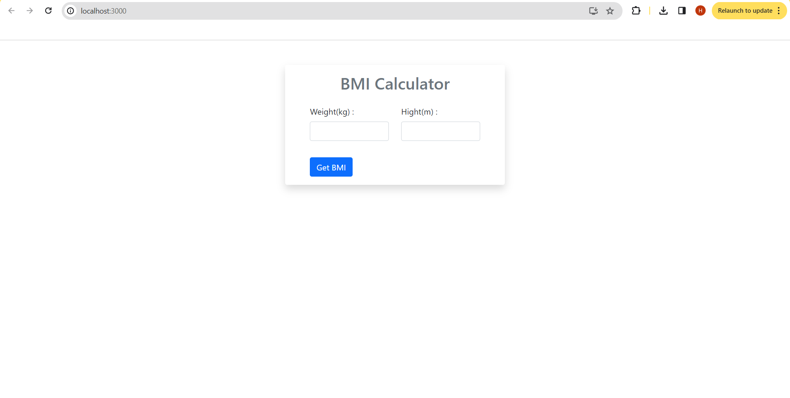
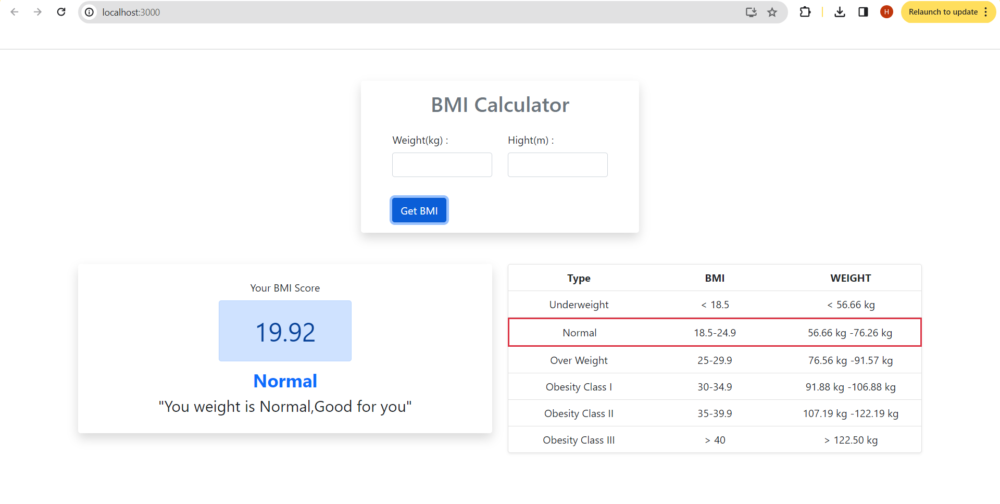
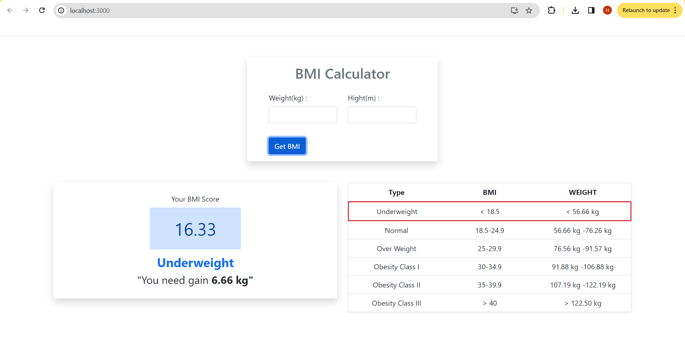
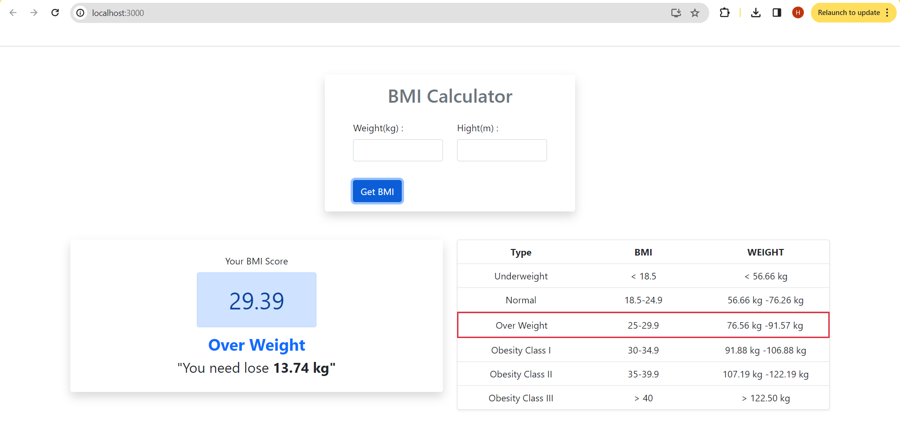

# BMI Calculator

## Overview
The BMI Calculator is a simple web application that allows users to calculate their Body Mass Index (BMI) based on their weight and height. It also provides a message card with guidance on whether the user's weight is in the "Underweight," "Normal," "Overweight," or "Obese" range and whether they need to increase or decrease their weight.

## Features
- Calculate BMI: Input your weight (in kilograms) and height (in meters) to calculate your BMI.
- BMI Categories: The application categorizes your BMI as "Underweight," "Normal," "Overweight," or "Obese" etc.
- Health Advice: Provides a message card with guidance on whether you need to increase or decrease your weight.

### Home Page


### Normal


### Under Weight


### Over Weight


## Installation

### Prerequisites
- Node.js and npm installed

1. Clone the repository:

   ```bash
   git clone https://github.com/Hafilu/Bmi-Calculator.git

   Navigate to the project directory:
   cd Bmi-Calculator
   
   Install project dependencies:
   npm install

   Start the React development server:
   npm start
   

## Usage
1. Open the BMI Calculator web application in your web browser using [localhost](http://localhost:3000/).

2. Input your weight (in kilograms) and height (in meters).

3. Click the "Calculate BMI" button.

4. The application will calculate your BMI and display your category (e.g., "Normal") and a health message card (e.g., "You are in a healthy weight range.").

5. Use this information to monitor your health and consider lifestyle changes if needed.

## BMI Categories
- Underweight: BMI less than 18.5
- Normal: BMI between 18.5 and 24.9
- Overweight: BMI between 25 and 29.9
- Obese: BMI greater than or equal to 30
- etc

## Customization
You can customize the appearance and styling of the BMI Calculator as needed. You can also modify the health advice messages to provide more detailed information or specific recommendations.

Feel free to use and modify this project for your needs.

Enjoy using the BMI Calculator!


 
